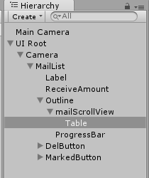

# xMailList
Unity使用NGUI制作的邮件列表程序，源于4月份的笔试题。目前是v0.5版本，待提升部分详见下文TODO部分。

## Feature
- 支持不等高邮件
- 可标记删除邮件 
- 模拟收邮件

## 运行平台
- 移动平台选择的iOS.
- Game视图分辨率选择的竖屏1536*2048
- NGUI版本3.8.2
- Unity版本5.1.4f1个人版(Mac)

## 项目关键文件及注意点说明
1. mailList.unity: 项目主场景，邮件列表的主要UI部分均在此处实现；由于要支持2.中的高度不同的邮件，因此在ScrollView下需要使用Table代替Grid;  

2. mailItem.prefab: 邮件Item单项，有纯文本邮件和带图片邮件两种高度不同的样式;
3. MailList.cs: 邮件的初始化、加载，模拟收到新邮件均在该脚本中进行，其中MailIte类用来代表邮件，mailBoxList存储所有收到的邮件;
  - InitMailBoxList(): 初始化邮件收件箱，创建指定数量(static int mailCount)的MailItem，并随机确定是否纯文本邮件;
  
  - InitMailList (int startFrom = 0): 每次OnEnable时调用，利用prefab创建从startFrom之后的特定数量(viewCount)的邮件Item并加入到Table中，
  并按照邮件收到的顺序修改Item的name属性，方便后续排序;
  
  - CompareMail(Transform t1, Transform t2): Table的OnCustomSort自定义比较方法, name大的排在最前;
  
  - UpdateNextVisable(): 更新下一组可见的邮件，例如刚开始初始可见为10个，当滚动条接近满时，调用该方法生成下10条邮件;
  
  - Update()方法中通过Time.realtimeSinceStartup % updateMailTime < 0.01f在特定的时间模拟收到新邮件;
  
  
## 重构优化TODO
- 使用对象池支持列表的循环利用
- 增加屏幕适配
- 提升代码规范
- 收到新邮件及删除邮件加入动画效果
